# Setup-Meteor-M-N2-N2-2-with-LRPT-Decoder-and-MeteorGIS

<!DOCTYPE html>
<html class="no-js" lang="en">
  <head>
    <meta http-equiv="content-type" content="text/html; charset=UTF-8">
    <meta charset="utf-8">
    <meta http-equiv="x-ua-compatible" content="ie=edge">
    <title>Setup Meteor M-N2/N2-2 with LRPTDecoder</title>
    <meta name="description" content="">
    <meta name="viewport" content="width=device-width, initial-scale=1">
    <link rel="canonical" href="http://html5-templates.com/">
    <link rel="apple-touch-icon" href="apple-touch-icon.png">
    <!-- Place favicon.ico in the root directory -->
    <link rel="stylesheet" href="style.css">
    
  </head>
  <body>
    <!--[if lt IE 8]>
            
You are using an <strong>outdated</strong> browser. Please <a href="https://browsehappy.com/">upgrade your browser</a> to improve your experience.

        <![endif]-->
    

      
 
        

          <h1>Setup Meteor M-N2/N2-2 with LRPT-Decoder</h1>
          <h1> </h1>
          
 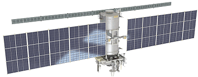 
          

           
          
The Meteor-M
            series are equipped with two imaging payloads. MSU-MR is a
            low-resolution instrument operating at visible-light and
            near-infrared wavelengths. 
            It will take wide-angle images of the Earth to help monitor
            cloud cover and the icecaps. The second imager, KMSS-2,
            provides complimentary high-resolution visible-light images
            of more specific areas.  
            The satellite also carries two sounding instruments: the
            MTVZA-GYa microwave radiometer and IKFS-2 infrared
            spectrometer, which will build profiles of temperatures,
            humidity and wind conditions within the atmosphere.

          
As well as direct
            weather monitoring, Meteor-M series are used to relay data
            from automated weather stations across the Earths surface.  
            BRK, also known as SSPD, is the communications payload that
            will facilitate this, receiving data from stations and
            re-transmitting it for collection and analysis.  
            A Kospas-SARSAT emergency communications payload, RK-SM-MKA,
            is also carried to detect and relay distress signals, aiding
            search-and-rescue operations around the world. 
          

          
As for searching
            continuous ways to improve Meteor reception, Vasili
            (rtl-sdr.ru - Plugins) and Oleg (LrptDecoder) did have the
            great idea to develop a QPSK Plugin in order to receive
            Meteor M-N2 images in real time thru LrptDecoder. 
            Since 2019 there are 2 Meteor satellites so we need another
            config/setup and trying to automate configuration changes
            with having minimal user input.

          
(Check current
            Meteor Mode's overhere: <a
              href="http://happysat.nl/Meteor/html/Meteor_Status.html"
              target="_blank">http://happysat.nl/Meteor/html/Meteor_Status.html</a>) 
          

           
          

            
Contents

            <ul>
              <li> 1Overview
                <ul>
                  <li>1.1&nbsp; <a href="#Hardware_Details">Hardware</a>
                  </li>
                  <li>1.2&nbsp; <a href="#Software_">Software</a>
                  </li>
                  <li>1.3&nbsp; <a href="#Setup_Orbitron_">Setup
                        Orbitron/SDRSharp</a> 
                    </li>
                  <li>1.4&nbsp; <a
                        href="#Setup_DDE-Tracking_Client__SDRSharp">Setup
                        DDE-Tracker</a> 
                  </li>
                  <li>1.5&nbsp; <a href="#Setup_QPSK_Plugin_">Setup
                        Meteor Demodulator Plugin</a> 
                  </li>
                  <li>1.6 <a
                        href="#Setup_LRPT-Decoder_for">LRPT-Decoder
                        Meteor M-N2/2-2</a> </li>
                  <li>1.7 <a href="#Setup_MeteorGIS_">Setup
                      MeteorGIS M-N2 and N2-2 
                    </a></li>
                  <li>1.8&nbsp; <a href="#Manual_LRPT-Decoder_setup_">Manual
                      LRPT-Decoder setup</a></li>
                  <li>1.9&nbsp; <a href="#Other_Tools_">Other Tools</a></li>
                  <li>2.0 <a href="#Telemetry_Unpacker_">Telemetry
                        Unpacker</a></li>
                  <li>2.1 <a
                        href="#Amateur_Meteor_Images_Global_Observation">AMIGOS</a> 
                    </li>
                </ul>
              </li>
            </ul>
          

          <h2>Hardware 
          </h2>
           
          To Use Real time image processing with Meteor, the following
          is needed for setup: 
           
          <b>SDR Radio capable receiver:</b> 
           
           
          <a href="https://airspy.com/airspy-r2/" target="_blank">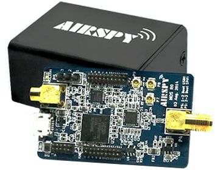</a> 
           
          <a href="https://airspy.com/airspy-r2/" target="_blank"
            style="text-decoration:none">Airspy R2</a> 
           
          Airspy R2 sets a new level of performance in the reception of
          the VHF and UHF bands thanks to its low-IF architecture based
          on Rafael Micro R820T2 and a high quality Oversampling 12bit
          ADC and state of the art DSP. 
          In Oversampling Mode, the Airspy R2 applies Analog RF and IF
          filtering to the signal path and increases the resolution to
          up to 16-bit using the software decimation.  
           
          The Airspy R2, is 100% compatible with all the existing
          software including the de facto scanning standard SDR#, but
          also a number of popular software defined radio applications
          such as: 
          SDR-Radio, HDSDR, GQRX and GNU Radio. 
           
          Continuous 24 – 1700 MHz native RX range. 
          3.5 dB NF between 42 and 1002 MHz, Maximum RF input of +10 dBm
          Tracking RF filters. 
          12bit ADC @ 20 MSPS (10.4 ENOB, 70dB SNR, 95dB SFDR), 10MSPS
          IQ output. 
          4.5v software switched Bias-Tee to power LNA’s and
          up/down-converters. 
           
           
           
          <a
href="https://www.nooelec.com/store/sdr/sdr-receivers/nesdr/nesdr-smartee-sdr.html"
            target="_blank">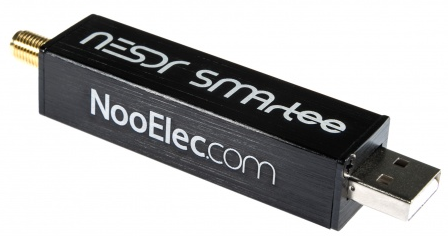</a> 
           
          <a
href="https://www.nooelec.com/store/sdr/sdr-receivers/nesdr/nesdr-smartee-sdr.html"
            target="_blank">Nooelec NESDR SMArTee - Premium RTL-SDR</a> 
           
          Premium RTL-SDR w/ aluminum enclosure, always-on bias tee,
          0.5PPM TCXO and SMA input. 
           
          The new PCB design of the NESDR SMArTee results in lower
          temperatures. 
          A custom heatsink is affixed to the primary PCB with 3M
          thermal adhesive, to wick heat away from the circuit board and
          towards the enclosure. 
           
          Power consumption has been reduced by an average of 10mA,
          which means less heat is generated compared to other designs. 
          The result is much lower board-level temperatures--increasing
          stability, improving sensitivity and ensuring maximum
          frequency range capability. 
           
          Bias-Tee features: 
          RF-suitable 4.2V regulator provides DC output to power your
          active electronics. 
          Bias-tee does NOT need to be enabled with hardware or software
          hacks.  
          No need to mess around with software or drivers to enable your
          bias tee! 
           
          RTL2832U Demodulator/USB interface IC, R820T2 tuner IC 
          4.2V 200mA always-on bias tee 
          0.5PPM, ultra-low phase noise TCXO 
          Integrated custom heatsink, Female SMA antenna input 
          High-quality black brushed aluminum enclosure 
           
           
          <b>LNA/Filter:</b> 
           
          <a
href="https://www.nooelec.com/store/sdr/sdr-addons/sawbird/sawbird-plus-noaa-308.html"
            target="_blank">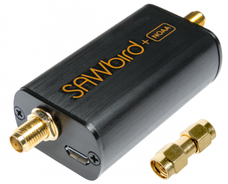</a> 
           
          <a
href="https://www.nooelec.com/store/sdr/sdr-addons/sawbird/sawbird-plus-noaa-308.html"
            target="_blank">Nooelec SAWbird+ NOAA - Premium SAW Filter
            &amp; Cascaded Ultra-Low Noise LNA Module 137MHz Center
            Frequency.</a> 
           
          SAWbird+ NOAA is a self-contained dual LNA module with an
          integrated high-performance SAW filter, designed for Meteor
          and NOAA weather satellites. 
          And filter out unwanted interfering signals like pagers from
          airport's or other electronic pollution. 
           
          It has a very high attenuation outside of the 5MHz bandpass
          region, centered around 137.5MHz, and a minimum of 30dB of
          gain within the bandpass region.  
          Nominal current draw is 180mA. 
           
          The SAWbird+ series contains 2 ultra-low-noise LNAs sandwiched
          around a custom-designed, high-performance SAW filter centered
          at the frequency of interest.  
          Each LNA module has 2 EMI shields to separate each delicate
          LNA from external interference.  
          There are also M3 mounting holes available to mount the PCB in
          your custom enclosure or project with standard hardware. 
           
          Each module allows for 3 different power options, but you
          should only power with one option at any given time! 
          The recommended power input through the SMA output port (for
          bias-tee capable SDRs like the above NESDR SMArTee) is 3V-5V
          DC.  
          Alternatively, if you don't have a bias-tee capable SDR, you
          can use the external power options through the microUSB port
          or the power input header. 
           
           
          <b>Antenna's:</b> 
           
          137Mhz Antenna Double Cross, Qfh, Turnstile or V-Dipoles: 
           
          <a href="http://happysat.nl/Double_Cross/" target="_blank"
            style="text-decoration:none">Double Cross Jerry Martes
            Design</a> 
           
          <a href="http://jcoppens.com/ant/qfh/calc.en.php"
            target="_blank" style="text-decoration:none">QFH John
            Coppens</a> 
           
          <a
href="http://lu1epc.blogspot.com/2017/01/dibujo-antena-turnstile-137-mhz.html"
            target="_blank" style="text-decoration:none">Turnstile I6IBE</a> 
           
          <a
href="http://lna4all.blogspot.com/2017/02/diy-137-mhz-wx-sat-v-dipole-antenna.html"
            target="_blank" style="text-decoration:none">Horizontal
            V-Dipole</a> 
           
          <h2>Software 
          </h2>
           
          
 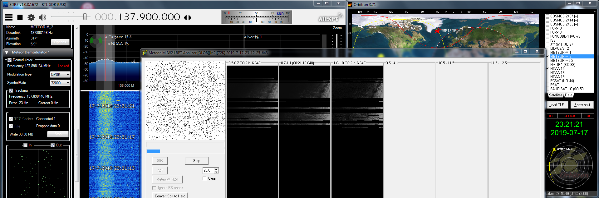 
            SDRSharp, Orbitron, LRPT-Decoder 
          

          <a href="https://airspy.com/download" target="_blank"
            style="text-decoration:none">SDRSharp</a> 
           
          
<a
              href="http://happysat.nl/meteor_2.3.zip">Meteor
              Demodulator Plugin v2.3</a> 
             
            Added interaction with Meteor LRPT-Decoder via socket and
            write control commands from the scheduler. 
            Added a mode of automatic detection of symbol speed. 
          

           
          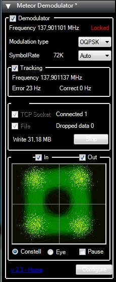 
           
          <a href="http://rtl-sdr.ru/uploads/download/ddetracker.zip"
            target="_blank" style="text-decoration:none">DDE Tracking
            Client v1.2</a> 
           
          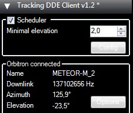 
           
          Download Meteor Demodulator, DDE-Tracking Plugins and add to
          SDRSharp folder and copy the lines inside magic.txt to
          plugins.xml. 
           
          M2 LRPT Decoder V56: 
           
          - Returned the window size in height to the value that was
          used previously. 
          - Fixed a bug that prevented using different paths for the
          output files from M2 and M22. 
           
          
<a
              href="http://happysat.nl/LRPT_Decoder_v56.zip">http://happysat.nl/LRPT_Decoder_v56.zip</a> 
          

          
 
            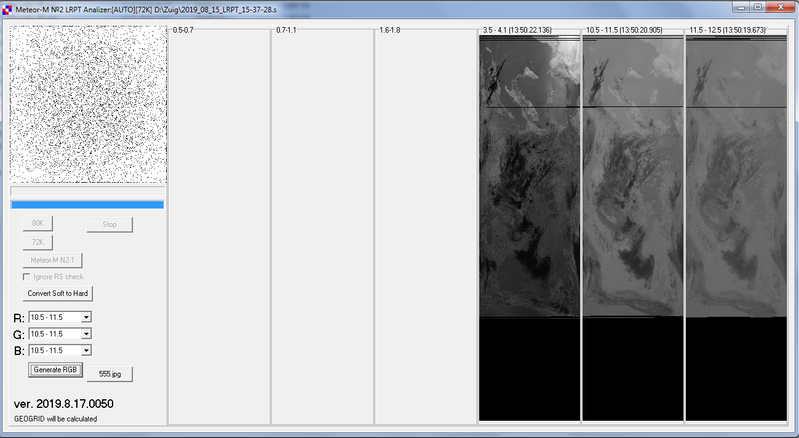 
          

          
 
          

          
This version of LRPTDecoder
            will work with both Meteor M-N2 and Meteor M-N2-2.

          
By design, Meteor
            Demodulator will manage the settings of the decoder and this
            should reduce the number of settings, 
            that must be done when Meteor changes operating modes. 
          

          
Example M2_LRPT_Decoder.ini
            configuration files for other modes are attached in the
            archive! 
          

           
          Download:<a href="http://www.meteorgis.space/" target="_blank">MeteorGIS</a> 
           
          Many changes read the changelog. 
          Use the tool "MeteorGIS_Configurator" who verify the .ini, and
          let you edit it more friendly.  
           
          A Satellite Tracking program like Orbitron (<a
            href="http://www.stoff.pl" target="_blank"
            style="text-decoration:none">http://www.stoff.pl</a>) or
          WXTrack (<a
            href="http://www.satsignal.eu/software/wxtrack.htm"
            target="_blank" style="text-decoration:none">http://www.satsignal.eu/software/wxtrack.htm</a>). 
           
          <h2>Setup Orbitron/SDRSharp 
          </h2>
           
          In short explained: 
           
          Orbitron or WXtrack taking care of the doppler shift frequency
          correction for the carrier of the Meteor Demodulator Plugin. 
          DDE Tracking client Plugin collects data from Orbitron or any
          other Tracking client. 
           
          Note it's not gonna be used for correcting the main tuned
          frequency in SDRSharp the signal will be unlocked from the
          QPSK Plugin using that!  
           
          If Satellite elevation &gt; 0 (AOS) trigger the start of
          applications needed for the receiving session: 
          start decoder program, set modulation and bandwidth, start
          some plugins (Meteor Demodulator, LRPT-Decoder, MeteorGIS, IF
          or Baseband recorder). 
           
          And send frequency correction (optional some stations report
          better reception without when having low or bad signal). 
           
          Meteor Demodulator first synchronizes with the signal in
          frequency configuration of the modulation speed and modulation
          type (satellite name). 
          If the satellite is gone (LOS) - stop recorders, Radio,
          Tracking and other plugins. 
           
          <b>Setup: </b> 
           
          Open Folder install location Orbitron\Config\setup.cfg in the
          driver section (end of file) below add this line required to
          point out your working SDRSharp install/location: 
           
          [Drivers] 
           
          SDRSharp=&lt;your path to SDRSharp
          folder&gt;\SDRSharp\SDRSharp.exe 
           
          Save and start Orbitron, make sure you have a up to date TLE
          file containing Meteor M-N2 and M-N2-2 Satellite's. 
          Insert this url in Main/Click Tools Icon/TLE Updater
          (http://www.celestrak.com/NORAD/elements/weather.txt). 
           
          Select Meteor M2 in the right list with the checkbox. 
          &nbsp; 
          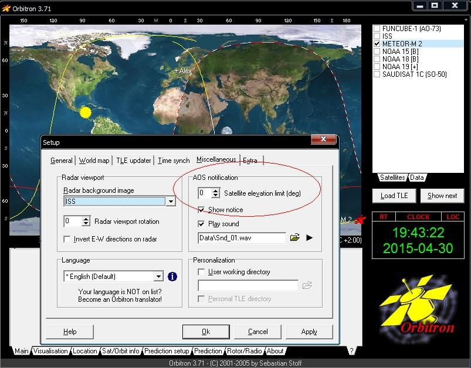 
           
          Goto Main/Setup (the tool icon) Miscellaneous tab and set AOS
          notification to 0 (or any other elevation value when Meteor is
          receivable in your location). 
           
          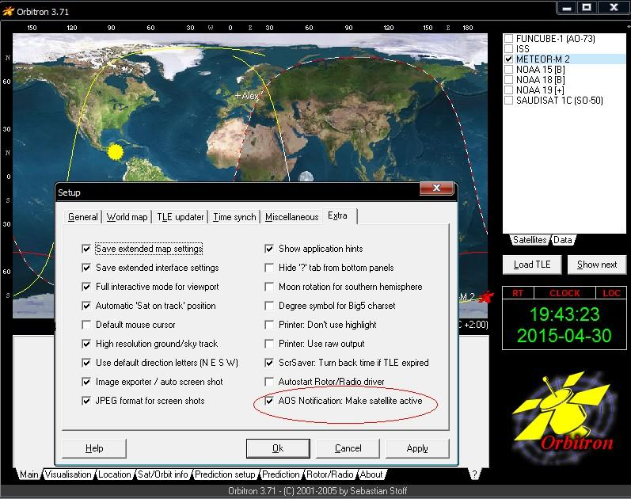 
           
          Then goto Extra tab last option AOS Notification: Make
          satellite active. 
           
          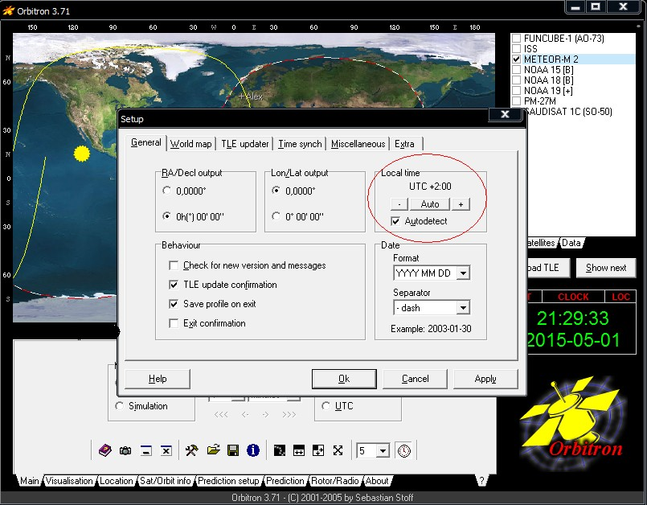 
           
          Repeat these steps to add Meteor M-N2-2. 
          <b>Check the correct time zone!</b> 
           
          Fill in your location/GPS coordinates in the location tab. 
           
          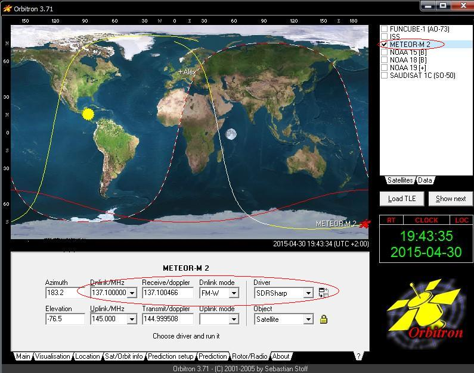 
           
          Goto tab Rotor/Radio, make sure in Dnlink/MHz: 137.100Mhz is
          filled in (Check current Meteor Mode's overhere: <a
            href="http://happysat.nl/Meteor/html/Meteor_Status.html">http://happysat.nl/Meteor/html/Meteor_Status.html</a>), 
          Dnlink mode: FM-W, select SDRSharp from the Driver dropdown
          box and click the icon next to it above the lock symbol. 
           
          SDRSharp will start. 
           
          Main Frequency in SDRSharp must be set to (Check current
          Meteor Mode's overhere: <a
            href="http://happysat.nl/Meteor/html/Meteor_Status.html">http://happysat.nl/Meteor/html/Meteor_Status.html</a>)
          Modulation WFM and preferred bandwidth 90000 Hz. 
          Tuner bandwidth to 1.4MSPS, 1.4 MSPS is needed IF samplerate
          will be &gt; 288 kHz 
          Meteor Demodulator plugin will show a warning when using <b>lower
            bitrates! </b> 
          <h2>Setup
            DDE-Tracking Client 
          </h2>
           
          Who can better explain this then the author himself :) 
           
          <a
href="https://translate.googleusercontent.com/translate_c?depth=1&amp;hl=ru&amp;rurl=translate.google.ru&amp;sl=ru&amp;sp=nmt4&amp;tl=en&amp;u=http://rtl-sdr.ru/page/komplekt-plaginov-dlja-priema-ka-meteor-i-drugih&amp;xid=17259,15700022,15700043,15700186,15700191,15700256,15700259,15700262&amp;usg=ALkJrhj069dszuCsI-UTiZ3RdsUTETCZWw"
            target="_blank" style="text-decoration:none">Follow this
            guide from RTL-sdr.ru in English</a> 
           
          In options button you can choose which Tracking program is
          going to be used, default is Orbitron. 
           
          Check the box in the DDE Tracking client Plugin 'Satellite
          Tracking' and after a few seconds the sat name, frequency,
          elevation is listed from Orbitron with Meteor's details
          indicating doppler is active. 
           
          A minimal elevation can be set like in Orbitron for example
          above 5 Degrees so the tracking client will be active and not
          on very low passes. 
           
          The config button display's the available commands in the
          scheduler. 
           
          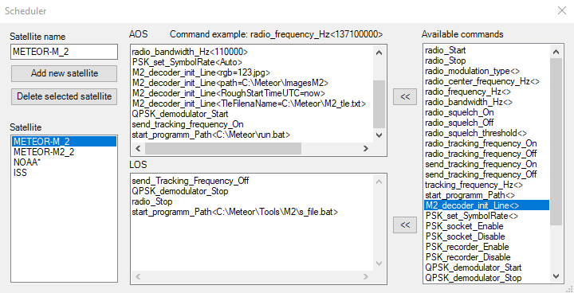 
           
          <b>AOS window section command explanation:</b> 
           
          radio start - SDRSharp start playing. (not visible on the
          screenshot left). 
          radio_modulation_type&lt;wfm&gt; - Modulation Wide Band FM
          (not visible on the screenshot left). 
          radio_center_frequency_Hz&lt;137570000&gt; - set's the center
          frequency to 137.570000MHz. ( we want the stream on the edge
          left if VDL2 signal from airports flies thru the spectrum, not
          visible on the screenshot left). 
          radio_frequency_Hz&lt;137100000&gt; - Tunes into 137.100MHz
          Meteors LRPT Frequency (not visible on the screenshot left). 
          radio_bandwidth_Hz&lt;90000&gt; - Bandwidth used 90000 Hz
          recommend. 
          set PSK_set_SymbolRate &lt;Auto&gt; - Meteor Demodulator
          plugin automatic detection mode of symbol rate. 
          M2_decoder_init_Line &lt;rgb=123.jpg&gt; or (rgb=125,444,555
          depending which mode Meteor is using), overrides path in
          decoder ini file. 
          M2_decoder_init_Line&lt;path=C:\Meteor\ImagesM2&gt; - Path to
          save images for M-N2, overrides path in decoder ini file. 
          M2_decoder_init_Line&lt;RoughStartTimeUTC=now&gt; - Using
          RoughStartTimeUTC = Now from the plugin, then Time will be
          initialized automatically at the moment of receipt of the
          first data, overrides path in decoder ini file. 
          M2_decoder_init_Line&lt;TleFileName=C:\Meteor\LRPT_Decoder\M2-2.txt&gt;
          - Path Meteor TLE File for Georef, overrides path in decoder
          ini file. 
          QPSK_demodulator_Start - QPSK Plugin is triggered to start
          from DDE Tracking Client by this command only for M-N2. 
          OQPSK_demodulator_Start - QPSK Plugin is triggered to start
          from DDE Tracking Client by this command Needed for M-N2-2. 
          send_tracking_frequency_On - Starting Doppler frequency
          correction for Meteor Demodulator Plugin carrier if the
          Satellite is active (If this is unwanted remove the command). 
          start_program_Path - LRPT-Decoder folder which includes
          run.bat, pointing to LRPT_Decoder.exe, explained more below. 
           
          <b>LOS window section command explanation:</b> 
           
          send_Tracking_Frequency_Off - Doppler correction for Meteor
          Demodulator Plugin Carrier stops. 
          QPSK_demodulator_Stop - Stop Meteor Demodulator Plugin, only
          for M-N2. 
          OQPSK_demodulator_Stop - Stop Meteor Demodulator Plugin,
          needed for M-N2-2. 
          radio_stop - SDRSharp stops playing. 
          start_programm_Path - Optional custom batch file with some
          commands to put s-files in another folder when both Meteor's
          are received to separate them. 
           
           
          Disable recorder and socket not needed. 
          radio_tracking_frequency_On not needed for meteors.  
          Use only with NOAA and voice satellite!  
          For meteors need use send_tracking_frequency_On only! 
          tracking_frequency_Hz is a internal command, part of
          send_tracking_frequency.  
          Not needed add to scheduler manually! 
          <h2>Setup Meteor Demodulator
            Plugin 
          </h2>
          
  
            Meteor Demodulator plugin sends received data in real time
            to Lrpt-Decoder via TCP Local Host connection (127.0.0.1)
            and/or can record and write a raw file called S-file. 
             
            Auto searchcarrier inside the Meteor Demodulator Plugin
            tunes to (Check current Meteor Mode's overhere: <a
              href="http://happysat.nl/Meteor/html/Meteor_Status.html">http://happysat.nl/Meteor/html/Meteor_Status.html</a>). 
            Meteor streams and lock on the signal if its strong enough.

          
 When Sat Tracking is checked it uses Doppler correction
            for a faster signal lock.

           
           
           
          
Note Tracking info will only displayed when the Satellite
            is active!

          
Config button is used to change the default PLL Bandwidth
            Value and a save path for writing the S-file.

          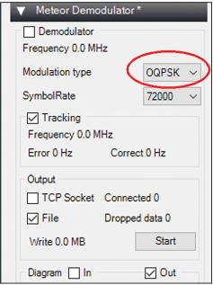 
           
          People who are not using DDE-Tracking Client, and running the
          Meteor Demodulator Plugin manual <b>Meteor M-N2-2 is using
            OQPSK Modulation</b>, make sure to select it! 
           
          How Meteor Demodulator plugin works: 
           
          If Satellite elevation &gt; 0 (AOS) trigger the start of
          applications needed for the receiving session: 
          Meteor Demodulator first synchronizes with the signal in
          frequency configuration of the modulation speed and modulation
          type (satellite name). 
          Automatic speed detection determines the symbolic flow rate. 
           
          There is no need to change the decoder settings when changing
          72K / 80K and M2 / M2.2.  
          LRPT-Decoder will receive signal information from the Meteor
          Demodulator plugin. 
          &nbsp; 
          Only after synchronization in frequency and symbol rate Meteor
          Demodulator plugin begin to transmit data to the decoder. 
          In the first block of data, the settings go to the decoder
          (automatically determined or set).  
           
          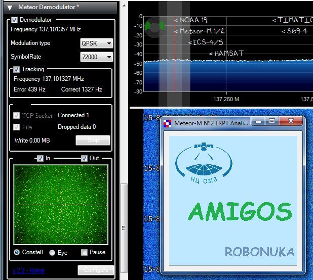 
           
          The decoder, until it receives data keeps the decoder window
          minimized. 
           
          After receiving the first data block, the decoder is
          initialized and begins to work building up an image line by
          line. 
          Without capturing the signal by Meteor Demodulator (after all,
          reception goes through the demodulator), the window will not
          close.  
           
          
If Meteors pass is over (LOS) Plugin will be inactive and
            LrptDecoder also quits saving received images. 
          

           
          Since Meteor Demodulator V2.3 a new scheduler command
          "M2_decoder_init_Line &lt;&gt;" has been added to the plugin. 
           
          Using it, you can transfer any commands that are in the
          M2_LRPT_Decoder.ini file of the LRPT-Decoder. 
           
          <b>Example scheduler options:</b> 
           
          M2_decoder_init_Line &lt;rgb=123.jpg&gt; or (rgb=125,444,555
          depending which mode Meteor is using), overrides path in
          decoder ini file. 
          M2_decoder_init_Line&lt;path=C:\Meteor\ImagesM2&gt; - Path to
          save images for M-N2 or M-N2-2, overrides path in decoder ini
          file. 
           
          M2_decoder_init_Line&lt;RoughStartTimeUTC=now&gt; - Using
          RoughStartTimeUTC = Now from the plugin, then Time will be
          initialized automatically at the moment of receipt of the
          first data, overrides path in decoder ini file. 
          M2_decoder_init_Line&lt;TleFileName=C:\Meteor\LRPT_Decoder\M2-2.txt&gt;
          - Path Meteor TLE File for Georef, overrides path in decoder
          ini file. 
           
          Make sure to enter these commands before the demodulator and
          decoder start entries. 
          QPSK_demodulator_Start 
          start_program_Path - Path&nbsp; to LRPT-Decoder 
           
          <b>In order for the decoder to work with Meteor Demodulator,
            the ini-file mode and sat entries must be assigned to auto!</b> 
           
          Inside M2_LRPT_Decoder.ini change: 
           
          mode=auto 
          sat=auto 
           
          There is no need to change the decoder settings when changing
          72K / 80K and M2 / M2.2.  
           
          LRPT-Decoder will receive signal information from the Meteor
          Demodulator plugin automatic detection mode of symbol speed.  
          And the type of modulation is determined by the choice of
          satellite M2 / M22. 
           
          In this mode, you can generally remove the term
          PSK_set_SymbolRate &lt;&gt; from the scheduler or set
          PSK_set_SymbolRate &lt;Auto&gt;.  
          Changes practically do not affect the reception quality.  
           
          It is enough to change the speed in the scheduler. 
           
          M2 LRPT-Decoder compatible with these functions is above
          Version 50. 
          <h2>Setup LRPT-Decoder
            for Meteor M-N2 and M-N2-2</h2>
           
          The idea is to run 1 LRPT-Decoder for both Meteor satellite's
          and this should reduce the number of settings that must be
          done when Meteor changes operating modes. 
           
          This allows to modify the settings when changing the reception
          conditions only in the scheduler from DDE Tracking Client, 
          and not in the entire chain of programs for processing the
          signal from the satellite. 
           
          <b>DDE-Tracker client scheduler setup for Meteor M-N2:</b> 
           
           
           
          The<b> difference between Meteor M-N2 and N2-2 is QPSK
            Modulation</b> &lt;- QPSK_demodulator_Start mode must be
          selected for M-N2! 
           
          set PSK_set_SymbolRate &lt;Auto&gt; - Meteor Demodulator
          plugin automatic detection mode of symbol rate. 
           
          M2_decoder_init_Line &lt;rgb=123.jpg&gt; or (rgb=125,444,555
          depending which mode Meteor is using), overrides path in
          decoder ini file. 
           
          <b>If you do not want all received images into 1 folder:</b> 
          M2_decoder_init_Line&lt;path=C:\Meteor\ImagesM2&gt; - Path to
          save images for M-N2, overrides path in decoder ini file. 
           
          <b>If you want to use georeference for mapping boundaries or
            test ect, include:</b> 
          M2_decoder_init_Line&lt;RoughStartTimeUTC=now&gt; - Using
          RoughStartTimeUTC = Now from the plugin, then Time will be
          initialized automatically at the moment of receipt of the
          first data, overrides path in decoder ini file. 
          M2_decoder_init_Line&lt;TleFileName=C:\Meteor\LRPT_Decoder\M2-2.txt&gt;
          - Path Meteor TLE File for Georef, overrides path in decoder
          ini file. 
           
          QPSK_demodulator_Start - QPSK Plugin is triggered to start
          from DDE Tracking Client by this command only for M-N2. 
          send_tracking_frequency_On - Starting Doppler frequency
          correction for Meteor Demodulator Plugin carrier if the
          Satellite is active (If this is unwanted remove the command). 
           
          start_program_Path - Path&nbsp; to LRPT-Decoder for startup
          run.bat (do not use a path with spaces example program
          files!). 
          The batch file run.bat point's to LRPTDecoder.exe and already
          included in the LRPT-decoder folder/archive, just enter its
          path &lt;your path\run.bat&gt; to the scheduler. 
           
          <b>Batch file contents:</b> 
           
          START M2_LRPT_Decoder.exe M2_LRPT_Decoder.ini 
           
           
          <b>DDE-Tracker client scheduler setup for Meteor M-N2-2:</b> 
           
          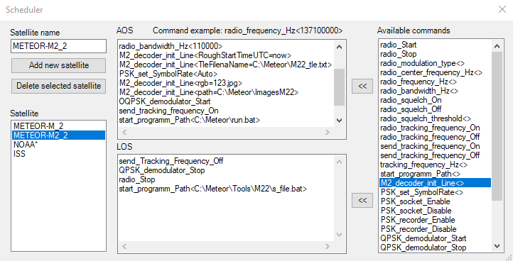 
           
          The <b>difference between Meteor M-N2-2 and N2 is OQPSK
            Modulation</b> &lt;- OQPSK_demodulator_Start must be
          selected for M-N2-2! 
           
          <b>If you want to use georeference for mapping boundaries or
            test ect, include:</b> 
          M2_decoder_init_Line&lt;RoughStartTimeUTC=now&gt; - Using
          RoughStartTimeUTC = Now from the plugin, then Time will be
          initialized automatically at the moment of receipt of the
          first data, overrides path in decoder ini file. 
          M2_decoder_init_Line&lt;TleFileName=C:\Meteor\LRPT_Decoder\M2-2.txt&gt;
          - Path Meteor TLE File for Georef, overrides path in decoder
          ini file. 
           
          M2_decoder_init_Line &lt;rgb=123.jpg&gt; or (rgb=125,444,555
          depending which mode Meteor is using), overrides path in
          decoder ini file. 
           
          <b>If you do not want all received images into 1 folder:</b> 
          M2_decoder_init_Line&lt;path=C:\Meteor\ImagesM22&gt; - Path to
          save images for M-N2-2, overrides path in decoder ini file. 
           
          OQPSK_demodulator_Start - QPSK Plugin is triggered to start
          from DDE Tracking Client by this command only for M-N2-2. 
          send_tracking_frequency_On - Starting Doppler frequency
          correction for Meteor Demodulator Plugin carrier if the
          Satellite is active (If this is unwanted remove the command). 
           
          start_program_Path - Path to LRPT-Decoder for startup run.bat. 
          <b>It must be the very same path as setup above for Meteor
            M-N2! (we use 1 Decoder).</b> 
           
           
           
          In Extracted downloaded LRPTDecoder archive 
           
          <b>Open M2_LRPT_Decoder.ini</b> 
           
          <b>Edit:</b> 
           
          [IN] 
          source=TCP  
          mode=auto 
          sat=auto 
          host=localhost 
          port=2011 
           
          [OUT] 
          rgb=123.jpg  
          rgb_q=100 
          mono=yes 
          logs=no 
          APID70=no 
          VCDU=no 
          path=C:\Meteor\ImagesM22 (edit to your path of images) 
          path =C:\Meteor\Images\M20 for Meteor-M No. 2 
          pathM22 =C:\Meteor\Images\M22 for Meteor-M No. 2.2 
           
          If you want to use georeference for mapping boundaries
          include: 
          GEO Creates a gcp which can be used for MeteorGIS or
          LRPT_Places to insert boundaries or cities.. 
           
          [GEO] 
          RoughStartTimeUTC=18-8-2019 
          TleFileName=C:\Meteor\LRPT_Decoder\M2-2.txt&nbsp; (Use <a
href="file:///D:/Program%20Files/SDR/Setup/Audio/Deadsat_website/Setup_Meteor/Setup.html#LRPT_Places_">Meteor
            TLE-Loader</a> paste M-N2-2 TLE info into new text file
          called M2-2.txt). 
          Alfa_M2=110.8 
          Delta_M2=32 
          Alfa_M22=110.8 
          Delta_M22=-4.8 
           
          Alfa - camera angle 
          Delta - offset along the line 
          &nbsp; 
          Selecting Delta achieve alignment of the coastline in the
          center of the image.  
          Then, changing Alfa, you can expand / contract images on a
          line. 
           
          When choosing delta, be aware that a change of 1 will result
          in a shift of about 1 km for misplaced overlay correction. 
           
          For AMIGOS (Only Meteor M-N2) 
           
          [GLOB] 
          AmigoID=0  
          mode=UDP 
          path=C:\Meteor\Tools\AMIGOS\ShareFolder (edit to your path of
          AMIGOS when used or leave out [GLOB] section ) 
          host=185.26.115.106 
          port=2013 
           
          [FAST] 
          FORMAT=jpg 
          R=1 
          G=2 
          B=3 
           
          <b>Save M2_LRPT_Decoder.ini</b> 
          
 

          <h2>Setup MeteorGIS Meteor-M-N2
            and N2-2 
          </h2>
           
          <b>Make sure to read and understand the</b> <a
            target="_blank"
href="https://drive.google.com/file/d/0B9HuDROb5aCyeUF2VlVUQjVaZjQ/view?usp=sharing"
            style="font-family: &quot;Times New Roman&quot;; font-size:
            medium; font-style: normal; font-variant-ligatures: normal;
            font-variant-caps: normal; font-weight: 400; letter-spacing:
            normal; orphans: 2; text-align: -webkit-center; text-indent:
            0px; text-transform: none; white-space: normal; widows: 2;
            word-spacing: 0px; -webkit-text-stroke-width: 0px;">Guide
            for MeteorGIS software for meteor MN2</a> 
           
          Download: <a href="http://www.meteorgis.space/"
            target="_blank">MeteorGIS</a> 
           
          Extract MeteorGIS and LRPT-Decoder to C:\Meteor\&nbsp;  
          Only the M2_LRPT_Decoder.exe is needed, ini files will be
          generated from MeteorGIS. 
           
          <b>Do not forget </b>to copy out SGP4.dll from folder
          meteorgis\file_to_put_in_M2_LRPT_Decoder_folder\ into
          C:\Meteor\&nbsp; its needed to create the composite images
          ect.! 
           
          To make configuration/setup of MeteorGIS easier the Authors
          did make a very handy tool: 
          <b>Find MeteorGIS_Configurator.exe in extracted MeteorGIS
            Folder</b> double click choose the default.ini and adjust
          your settings in the following tabs. 
           
          <b>But first run MeteorGIS.exe once so it can create a
            default.ini configuration file to edit! 
             
            Bug in v2.24 does not create a default.ini, <a
              href="default.zip">download default.ini overhere</a> (will
            be fixed)! 
          </b>  
          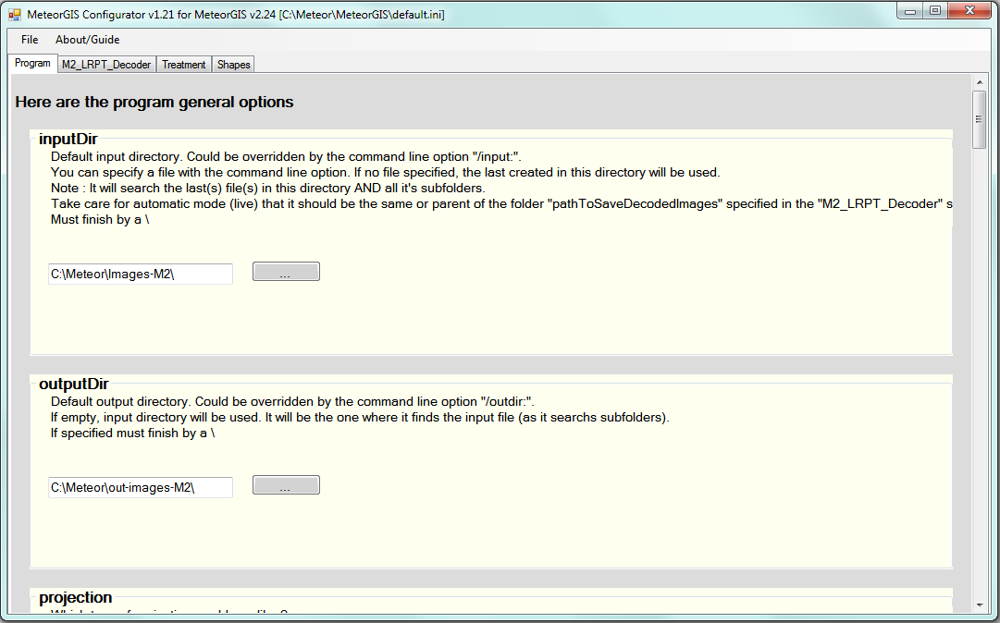 
           
          <b>As of MeteorGIS v.2.20 no more need of 2 ini and a batch
            file, Sat is automatically detected in auto mode.</b> 
           
          <b>For this setup you do not have to make any changes to
            M2_LRPT_Decoder.ini, MeteorGIS will handle the
            configuration.</b> 
           
          <b>Example of only the folder setup in default.ini:</b> 
           
          <b>[Program]</b> 
          inputDir=C:\Meteor\images-M2\&nbsp; <b>&lt;&lt;-- Where
            LRPT-decoder saves images</b> 
          outputDir=C:\Meteor\out-images-M2\&nbsp; <b>&lt;&lt;-- Here
            you will find processed images by MeteorGIS, Composite,
            Treated ect from both Meteor's.</b> 
          <b>[M2_LRPT_Decoder]</b> 
          pathToM2_LRPT_Decoder=C:\Meteor\&nbsp;<b>
            &lt;&lt;--LRPT-Decoder.exe </b> 
          pathToSaveDecodedImages=C:\Meteor\images-M2\M2\&nbsp; <b>&lt;&lt;--
            Images of Meteor M2</b> 
          pathToSaveDecodedImagesM22=C:\Meteor\images-M2\M22\ <b>&lt;&lt;--
            Images of Meteor M22</b> 
           
          The folder structure: 
           
          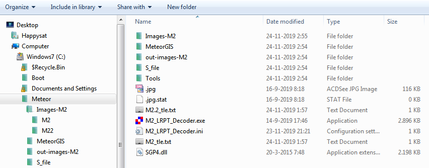 
           
          C:\Meteor\  
          &nbsp;&nbsp;&nbsp;&nbsp;&nbsp;&nbsp;&nbsp;&nbsp;&nbsp;&nbsp;&nbsp;&nbsp;&nbsp;&nbsp;&nbsp;&nbsp;&nbsp;&nbsp;&nbsp;&nbsp;&nbsp;&nbsp;
          &nbsp;&nbsp; Images-M2\ 
          &nbsp;&nbsp;&nbsp;&nbsp;&nbsp;&nbsp;&nbsp;&nbsp;&nbsp;&nbsp;&nbsp;&nbsp;&nbsp;&nbsp;&nbsp;&nbsp;&nbsp;&nbsp;&nbsp;&nbsp;&nbsp;
          &nbsp; &nbsp; Images-M2\M2 
          &nbsp;&nbsp;&nbsp;&nbsp;&nbsp;&nbsp;&nbsp;&nbsp;&nbsp;&nbsp;&nbsp;&nbsp;&nbsp;&nbsp;&nbsp;&nbsp;&nbsp;&nbsp;&nbsp;&nbsp;&nbsp;
          &nbsp; &nbsp; Images-M2\M22 
          &nbsp;&nbsp;&nbsp;&nbsp;&nbsp;&nbsp;&nbsp;&nbsp;&nbsp;&nbsp;&nbsp;&nbsp;&nbsp;&nbsp;&nbsp;&nbsp;&nbsp;&nbsp;&nbsp;&nbsp;&nbsp;&nbsp;&nbsp;&nbsp;&nbsp;
          MeteorGIS 
          &nbsp;&nbsp;&nbsp;&nbsp;&nbsp;&nbsp;&nbsp;&nbsp;&nbsp;&nbsp;&nbsp;&nbsp;&nbsp;&nbsp;&nbsp;&nbsp;&nbsp;&nbsp;&nbsp;&nbsp;&nbsp;&nbsp;&nbsp;&nbsp;&nbsp;
          out-images 
          &nbsp;&nbsp;&nbsp;&nbsp;&nbsp;&nbsp;&nbsp;&nbsp;&nbsp;&nbsp;&nbsp;&nbsp;&nbsp;&nbsp;&nbsp;&nbsp;&nbsp;&nbsp;&nbsp;&nbsp;&nbsp;
          &nbsp; &nbsp; S_file\ 
          &nbsp;&nbsp;&nbsp;&nbsp;&nbsp;&nbsp;&nbsp;&nbsp;&nbsp;&nbsp;&nbsp;&nbsp;&nbsp;&nbsp;&nbsp;&nbsp;&nbsp;&nbsp;&nbsp;&nbsp;&nbsp;&nbsp;
          &nbsp;&nbsp; Tools\ 
          &nbsp;&nbsp;&nbsp;&nbsp;&nbsp;&nbsp;&nbsp;&nbsp;&nbsp;&nbsp;&nbsp;&nbsp;&nbsp;&nbsp;&nbsp;&nbsp;&nbsp;&nbsp;&nbsp;&nbsp;&nbsp;&nbsp;&nbsp;
          &nbsp; M2_LRPT-Decoder.exe 
           
          <b>Next is setup commands for MeteorGIS in Scheduler.</b> 
           
          <b>Example Meteor M-N2 Setup in DDE Tracking Client Scheduler
            Config:</b> 
           
          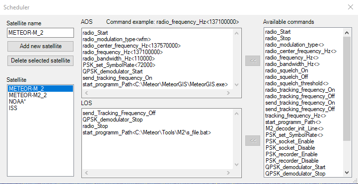 
          <b> 
          </b><b> These lines are important:</b> 
           
          The frequency Check current Meteor Mode's overhere: <a
            href="http://happysat.nl/Meteor/html/Meteor_Status.html"
            target="_blank">http://happysat.nl/Meteor/html/Meteor_Status.html</a> 
           
          set PSK_set_SymbolRate &lt;72000&gt; for Meteor M-N2. 
           
          start_programm_Path&lt;C:\Meteor\MeteorGIS\MeteorGIS.exe&gt; -
          Path to MeteorGIS.exe folder (dont use a path with spaces
          example program files!.) 
          <b> 
          </b><b> So change this in DDE Tracking Client schedule
            commands!</b> 
           
           
          <b>Example Meteor M-N2-2 Setup in DDE Tracking Client
            Scheduler Config:</b> 
           
          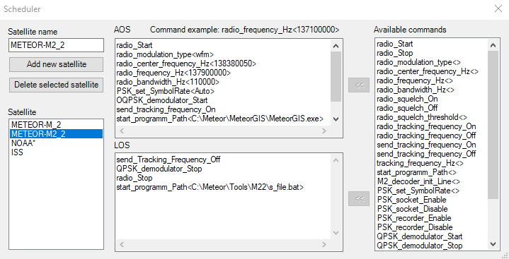 
           
          <b>These lines are important:</b> 
           
          The frequency Check current Meteor Mode's overhere: <a
            href="http://happysat.nl/Meteor/html/Meteor_Status.html"
            target="_blank">http://happysat.nl/Meteor/html/Meteor_Status.html</a> 
           
          set PSK_set_SymbolRate &lt;Auto&gt;  
           
          start_programm_Path&lt;C:\Meteor\MeteorGIS\MeteorGIS.exe&gt; -
          Path to MeteorGIS.exe folder (dont use a path with spaces
          example program files!.) 
           
          (Optional) The s_file.bat file in the scheduler contains: 
           
          move C:\Meteor\S_file\* C:\Meteor\S_file\M22 
           
          And does move the s-file after the pass to different folders. 
           
          <b>So change this in DDE Tracking Client schedule commands!</b> 
           
          When Meteor rises above the horizon in Orbitron (you can check
          with simulation mode) , 
          The scheduler will execute the commands, starting MeteorGIS: 
           
          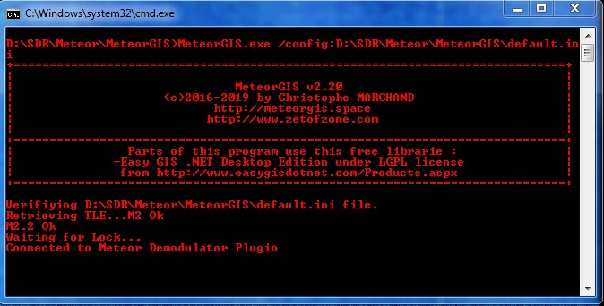 
           
          When a <b>signal lock</b> is detected LRPT Decoder will
          start:&nbsp;&nbsp;  
           
          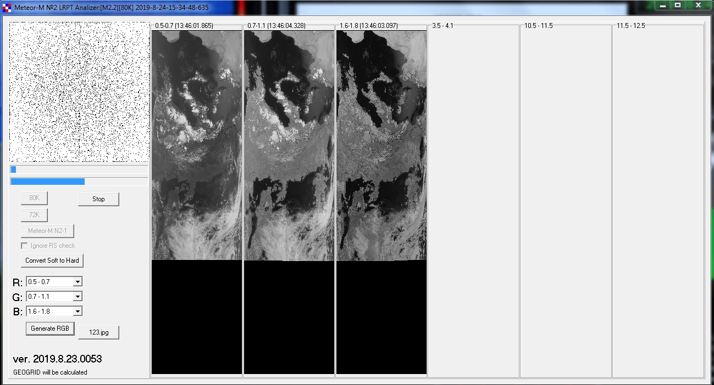 
           
          MeteorGIS
            can manually started in offline mode with a batch file to
            re-process Meteor M-N2 and N2-2 Images, in case something
            did go wrong. 
             
          <b>Command Line Options for MeteorGIS:</b> 
           
          <b>/nolive</b> 
          By default, MeteorGIS will work in automatic mode.  
          It can launch the decoder (M2_LRPT_Decoder.exe) after creating
          the right ini file for it.  
          If you specify this option, you have to make it by yourself,
          or for treat some old images. 
          If you didn't use this option (mean automatic mode) take care
          to not specify an input file (but folder instead) 
           
          <b>/notle</b> 
          If you specify this option, the program will not try to
          download the latest available TLE. (Don't use unless you want
          to treat old .s file.) 
           
          <b>/input:</b> 
          Specify an input file to treat it. Could be a folder, in this
          case it will search for the last file in this folder AND
          subfolders. 
          File specified could be a jpg, a bmp (in this case give one of
          the 3 channels bmp name) or a .s file (Read the
          "About_.s.txt"). 
          Jpg images are NOT post-treated. 
          Of course, you must have the .gcp file in relation with it
          (apart for .s file - it will be generated). 
           
          <b>/outdir</b>: 
          Specify the output folder for treated files. If not exist,
          will be created. 
          Take care as if you put the folder embraced in quotes (") for
          example if the path contain space, to NOT PUT a \ at the end
          !!! 
           
          <b>/type:</b> 
          The type(s) of image(s) generated. Override the option in the
          "Program" section. 
          Should be one or more of the following (separate them by a
          coma ",") rgb,ir,thermal,ir_rain,rgb_rain 
           
          <b>/proj:</b> 
          The type of projection (UTM or LatLon). Override the option in
          the "Program" section. 
          Should be UTM or Mercator. 
           
          <b>/config:</b> 
          Specify another ini file if you want to keep different
          configurations. 
           
          <b>/compose:</b> 
          Specify one or more image(s) to be composed with the input
          one. Must be the entire path to the image(s). 
          If you specify more than one file separate them by a coma. 
           
          <b>/composeauto</b> 
          The program will create all image(s) specified or found in
          input (only if doesn't yet exist) plus a composition of all
          passes within the timespan Composition option of the file
          specified as input (or last one if a folder is specified). 
          This option is used only if you use the /nolive option (manual
          mode). In case of live reception, this option is always set. 
           
          <b>/sat:</b> 
          Used only if processing .s file. To give the decoder the right
          tle file and save folder + put the right sat name on
          watermark. 
          For manual mode (only for .s
              file) you need to specify the sat name (M2 or M2.2) with
              the command line /sat: 
          <b> 
          </b><b> </b><b>Make a batch file named Manual_M2_GIS.bat
            inside the MeteorGIS folder.</b> 
            &nbsp; 
            C:\Meteor\MeteorGIS\MeteorGIS.exe /nolive /composeauto
            /sat:M2
            /config:C:\Meteor\MeteorGIS\default.ini&nbsp;&nbsp;&nbsp;&nbsp;
             
           
            <b>Make another for Manual_M2-2_GIS.bat and insert:</b> 
             
            C:\Meteor\MeteorGIS\MeteorGIS.exe /nolive /composeauto
            /sat:M2.2
            /config:C:\Meteor\MeteorGIS\default.ini&nbsp;&nbsp;&nbsp;&nbsp;&nbsp;&nbsp;&nbsp;
           
              
          Save, and
            run for manual re-processing. 
           
          Offcourse you need a s-file for
              re-processing first.! 
                   Make the changes for manual
              processing in LRPT-Decoder explained <a
href="file:///D:/Program%20Files/SDR/Setup/Website/Setup_Meteor/Setup.html#Manual_LRPT-Decoder_setup_">below</a>: 
               
            Tip: rename s-file without
                    _underscores for manual processing and GIS recognize
                    the format to create all images:
                    2019_11_23_LRPT_21-07-32.s into
                    2019-11-23-21-07-32.s 
                    Put created images in the folder you specified in
                    MeteorGIS config so GIS know where to find them. 
          <h2>Manual
            LRPT-Decoder setup 
          </h2>
           
          Setup without using SDR in real time for manual processing
          S-files. 
          <b>Example ini configuration files for other modes are
            attached in the archive!</b> 
           
          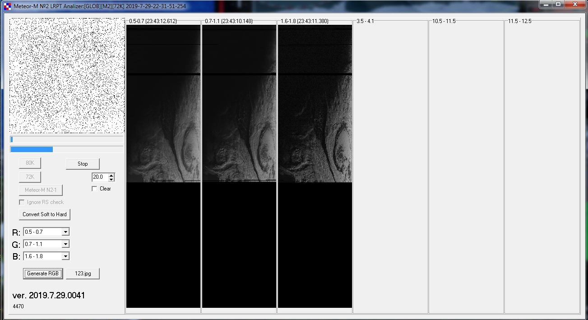 
           
          <b>Open M2_LRPT_Decoder.ini</b> 
           
          <b>Edit:</b> 
           
          [IN] 
          source=man or file path tcp will not work! 
          sat=M2 or M2.2  
          mode=72k or 80k 
           
          [OUT] 
          rgb=123.jpg (Meteor once in a while has maintenance cooling
          then IR channel's are turned off for some days making Channel
          1,2 and 3 active then this line must be inserted rgb=123.jpg 3
          visible channels + no IR otherwise when IR is active use
          125.jpg) 
          rgb_q=100 
          mono=yes 
          logs=no 
          APID70=no 
          VCDU=no 
          path=C:\Meteor\images-M2\ 
           
          GEO Creates a gcp which can be used for MeteorGIS or
          LRPT_Places to insert boundaries or cities.. 
           
          [GEO] 
          RoughStartTimeUTC=18-8-2019&nbsp; &lt;&lt;-- change to current
          date or date of re-processed s-file. 
          TleFileName=C:\Meteor\LRPT_Decoder\M2-2.txt&nbsp; &lt;&lt;--
          point to M2_tle.txt or M22 in MeteorGIS LRPT-Decoder folder. 
          Alfa_M2=110.8 
          Delta_M2=32 
          Alfa_M22=110.8 
          Delta_M22=-4.8 
           
          Alfa - camera angle 
          Delta - offset along the line 
          &nbsp; 
          Selecting Delta achieve alignment of the coastline in the
          center of the image.  
          Then, changing Alfa, you can expand / contract images on a
          line. 
           
          When choosing delta, be aware that a change of 1 will result
          in a shift of about 1 km for misplaced overlay correction. 
           
          [FAST] 
          FORMAT=jpg 
          R=1 
          G=2 
          B=3 
           
          (Meteor once in a while has maintenance cooling then IR
          channel's are turned off for some days making Channel 1,2 and
          3 active so the config is RGB 123, when IR is active use RGB
          125). 
           
          <b>Save M2_LRPT_Decoder.ini</b> 
          <h2>Other Tools 
          </h2>
          Image editing: 
           
          There are 2 excellent programs to edit Meteor's saved images,
          SmoothMeteor from Les Hamilton and LRPT Image Processor from
          David Taylor both are freeware. 
          They have option to rectify the image so the 'Fish-eye' effect
          is gone, Create False colors on RGB125 images, Flip Infrared
          Nighttime images and convert them with a negative effect so
          they look like NOAA IR Images. 
          And many other options. 
           
          Some extra explanation about Meteor images: 
          &nbsp; 
          When you save a Meteor image as an RGB125 BMP image, the image
          actually contains all the information for the three separate
          channels. 
          &nbsp;If you wish to store your Meteor images for the future,
          this is the best way. 
          &nbsp; 
          The new version of SmoothMeteor recognizes the 125.BMP part of
          the filename, and opens up the Palette menu. 
          &nbsp; 
          Here you find options to add palettes to the images. 
          &nbsp; 
          But you can also combine the channels in different ways: the
          RGB122 that is often used in LRPTofflineDecoder, but also the
          RGB125 (using the inverted channel 5), which is the same as
          the common colour composites made from NOAA HRPT channels
          1+2+4. 
          &nbsp; 
          There are also options to save each of the individual grey
          scale channels. 
           
          http://leshamilton.co.uk/meteor3m.htm 
           
          So change in LRPToffLineDecoder.ini : 
           
          [OUT] 
          rgb=125.jpg 
           
          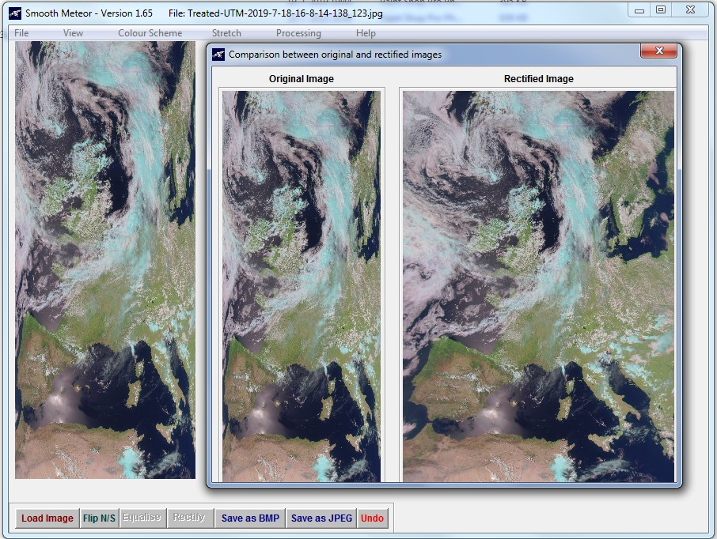 
           
          SmoothMeteor - <a
            href="http://leshamilton.co.uk/meteor3m.htm" target="_blank"
            style="text-decoration:none">http://leshamilton.co.uk/meteor3m.htm</a> 
           
          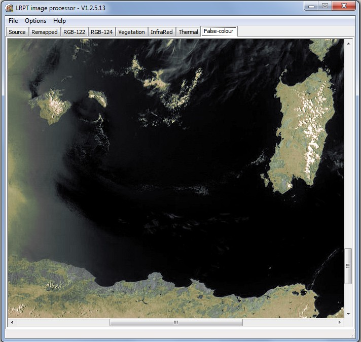 
           
          LRPT Image Processor - <a
            href="http://www.satsignal.eu/software/LRPT-processor.html"
            target="_blank" style="text-decoration:none">http://www.satsignal.eu/software/LRPT-processor.html</a> 
           
          <h2>Telemetry Unpacker 
          </h2>
           
          Meteor M-N2-2 Telemetry Unpacker: 
           
          Only for Meteor M-N2-2! 
          N-2-2 has a new different way of processing Telemetry on PID70
          e.g. info from Glonass and its position. 
           
          Program for unpacking telemetry from APID70 for testing. 
           
          Set APID70=yes in M2_LRPT_Decoder.ini [OUT] section. 
           
          It starts like this: 
           
          M22TelemetryUnpaker.exe 2019_07_29_LRPT_14-39-35.s.70 
          for unpacking 2019_07_29_LRPT_14-39-35.s.70, 
          will be formed 2019_07_29_LRPT_14-39-35.s.70.csv 
           
          Added to the telemetry unpacker information of TLE and the
          calculation of coefficients, polynomials of the fourth degree
          representing the roll, pitch and yaw of Meteor M-N2-2. 
          TLE can be used in Orbitron and for geo-referencing
          processing.  
          Roll, pitch, yaw can improve snapping to absolute accuracy! 
           
          Download <a href="http://happysat.nl/Telemetry.zip">Telemetry
            Unpacker</a> 
           
           
          <h1 style="color: rgb(0, 0, 0); font-family: &quot;Times New
            Roman&quot;; font-style: normal; font-variant-ligatures:
            normal; font-variant-caps: normal; letter-spacing: normal;
            orphans: 2; text-align: start; text-indent: 0px;
            text-transform: none; white-space: normal; widows: 2;
            word-spacing: 0px; -webkit-text-stroke-width: 0px;
            text-decoration-style: initial; text-decoration-color:
            initial;">Amateur&nbsp;Meteor&nbsp;Images&nbsp;Global&nbsp;Observation&nbsp;System.</h1>
           
          For AMIGOS (Only Meteor M-N2) 
           
          Users of LRPT decoder will automatically send UDP packets via
          port 2013 to the server, 
          if section global in M2_LRPT_Decoder.ini config file contains
          AMIGO Setup. 
           
          And if they work online, they become anonymous members of
          AMIGOS. 
           
          Setup M2_LRPT_Decoder: 
           
          If the new decoder is never started there is a section line
          called: 
           
          [GLOB] 
          AmigoID=0 
           
          After first start it will generate a uniqe ID for you, so
          meteor robonuka-servers can see from who this data is. 
           
          Setup parameter AmigoID=0. Zero means that ID will be
          generated automatically. 
          For anonymus ID&gt;10000, for registred(future) ID&lt;10000 
           
          Example (AmigoID=1174299964) 
           
          Open M2_LRPT_Decoder.ini 
           
          Add or change: 
           
          [GLOB] 
          AmigoID=0 
          mode=UDP 
          path=C:\AMIGOS\ShareFolder (edit to your path of AMIGOS) 
          host=185.26.115.106 
          port=2013 
           
          Save and Close. 
           
          AmigosViewer is a program to view received data from users on
          the server as an image. 
           
          Download: <a href="http://happysat.nl/AMIGOS.zip">
            AmigosViewer</a> 
           
          Setup AmigosViewer: 
           
          1. Run AmigosViewer.exe. 
          2. If after run in Caption of AmigosViewer window you can see 
          &nbsp;&nbsp; "Amigos Viewer [FTP][LOGIN]" it is OK and you can
          go next paragraph. 
          &nbsp;&nbsp; If not it means a problems offline. 
          3. Click "Start". 
          4. If you want see picture realtime - click big button
          "START". If you want 
          &nbsp;&nbsp; to see old data - uncheck "Online image" and set
          datetime and after click the "START". 
           
          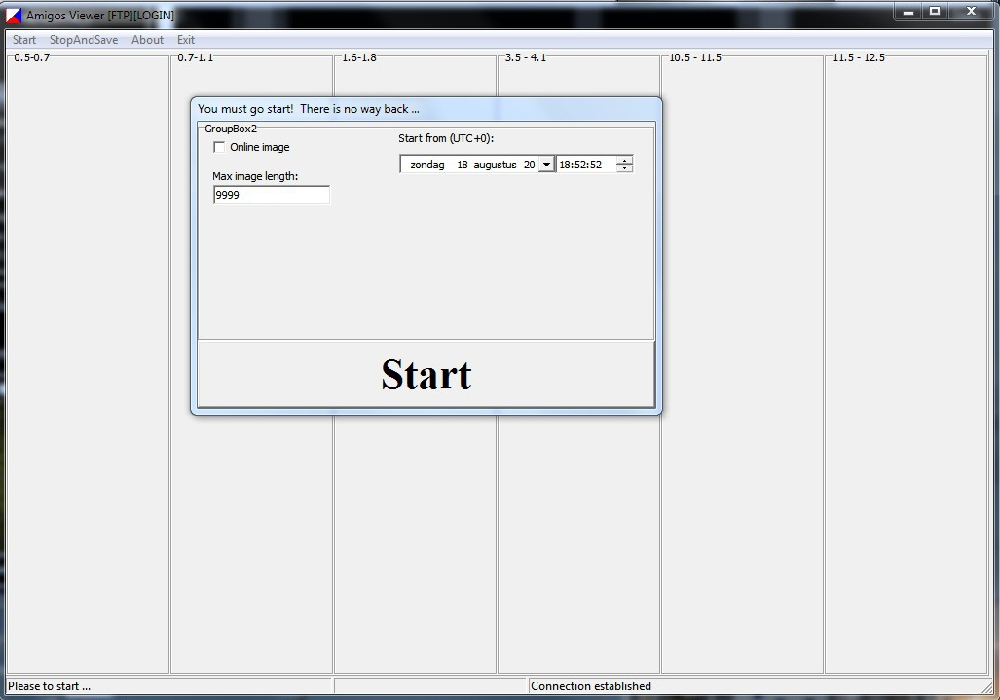 
           
          5. Wait the end of process. 
           
          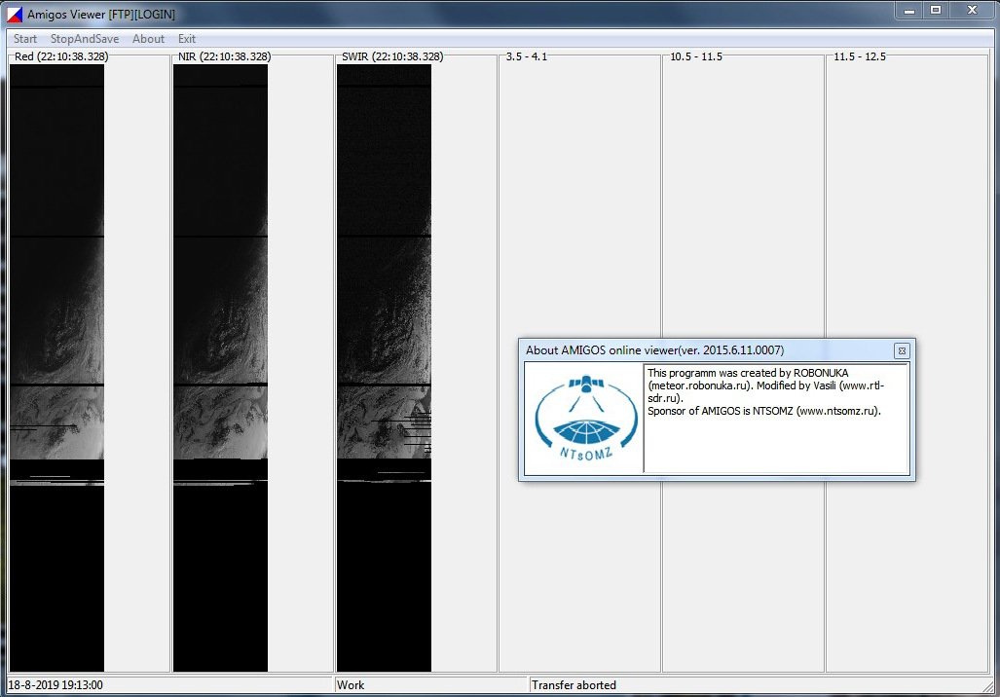 
           
          6. Click "StopAndSave" pictures of the viewer are saved in
          AMIGOS/IMAGES. 
          7. Click "Exit". 
          8. You can now view or process from folder images. 
           
          <a href="http://185.26.115.106:8080/" target="_blank">AMIGOS
            Webserver</a> 
           
          Special thanks to: 
          Oleg (LRPT-Decoder), Vasili (Meteor Demodulator/DDE-Tracker
          Plugins), Christoper Marchand and Thibaut Fouine (MeteorGIS),
          Youssef Touil (SDR#/Airspy Radio), Nooelec.com, Les Hamilton
          (SmoothMeteor),&nbsp; David Taylor (LRPT Image Processor),
          Herman-PB0AHX (Host), Mother Russia (Meteor M-N-Serie), and
          everybody on the Facebook APT-Group! 
        

        
 This page was last edited on 22.08.2020
          | Setup Meteor M-N2/N2-2 with LRPT-Decoder by Happysat 

      

    

    
    
    
  </body>
</html>
